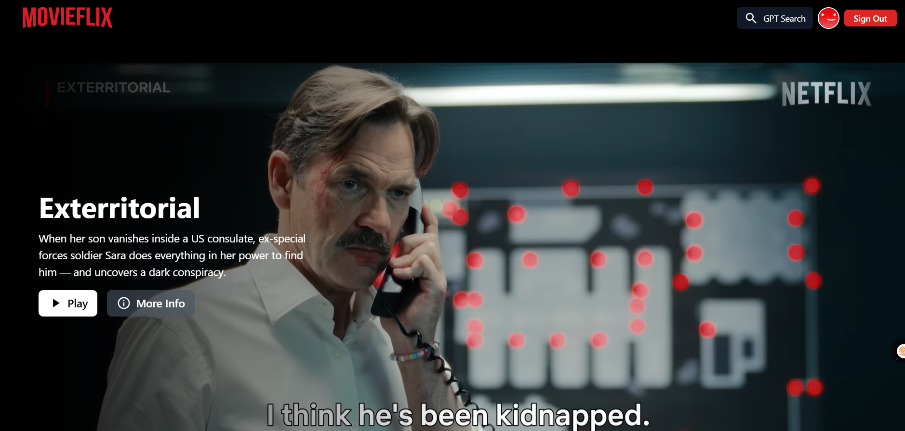
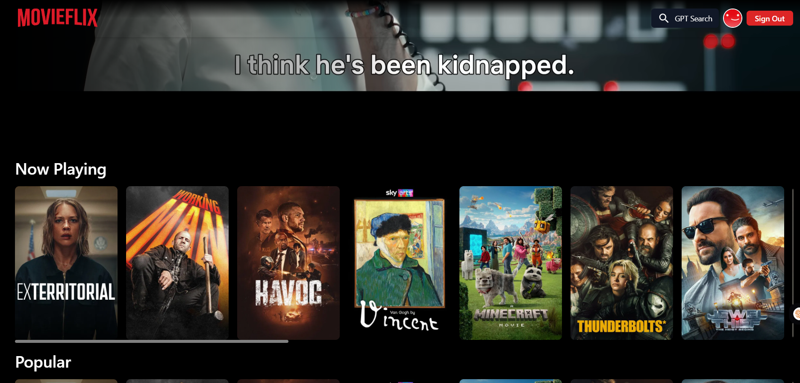
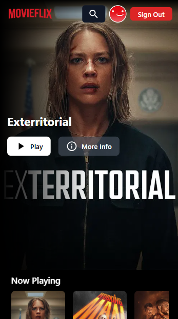
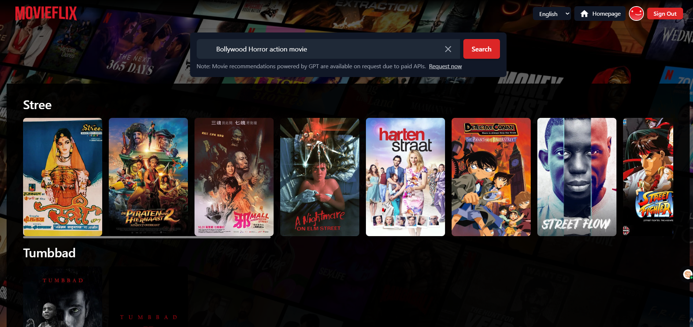
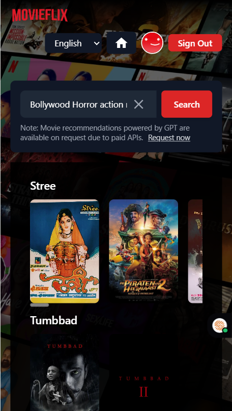
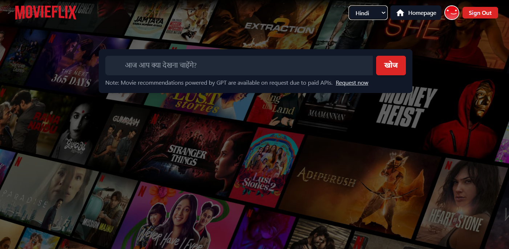
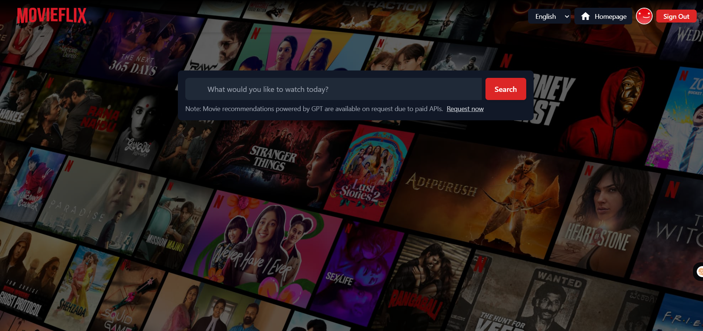
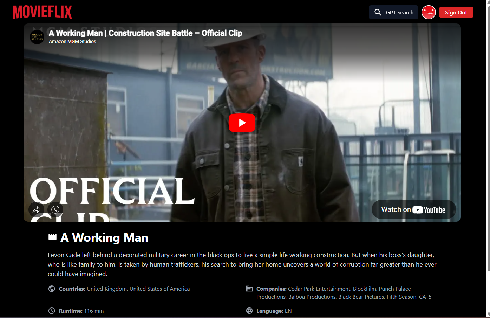
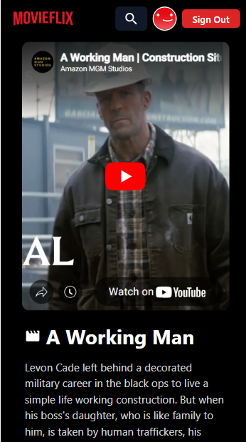

#

# 🎬 [MoviFlix (Netflix Clone) — Movie Streaming App with GPT Search](https://movieflix-fe.netlify.app/)

This is a **Netflix-inspired video streaming platform** built with modern frontend technologies like **React**, **Redux Toolkit**, **Tailwind CSS**, and **Material UI**. It features movie browsing, YouTube-based video playback, AI-powered movie search via GPT, and smooth shimmer loading for better UX.

## ✨ Features

- 🔍 GPT-powered movie search
- 🎥 YouTube player-based video playback
- 📃 Movie details with genres, production, language, and more
- 🧠 Smart shimmer UI during loading
- 🌐 Multilingual support with language switcher in Search page
- 👤 User authentication with Firebase
- 🧩 Fully responsive and mobile-first design

## 🚀 Technologies Used

- **React + Redux Toolkit** for state management
- **App Router** for routing and layout
- **Tailwind CSS** for utility-first styling
- **Material UI** for modern, accessible components
- **Firebase Auth** for login/logout
- **TMDB API** for fetching movie data
- **YouTube iFrame API** for embedded playback

## 🧠 GPT Search

Switch between the homepage and a **GPT-based movie search interface** by clicking the search icon in the header. You can filter results by language and explore recommendations powered by OpenAI's API.

## 🛠️ Setup Instructions

- Install react app using create-react-app (CRA)

```js
npx create-react-app movieflix-gpt
```

- Create `.env` file and put configure

```js
REACT_APP_BASE_URL = YOUR_APPLICATION_BASE_URL;
REACT_APP_FIREBASE_API_KEY = YOUR_FIREBASE_API_KEY;
REACT_APP_FIREBASE_APP_ID = YOUR_FIREBASE_APP_ID;
REACT_APP_OPENAI_KEY = YOUR_API_KEY_WILL_HERE;
REACT_APP_TMDB_KEY = YOUR_API_KEY_WILL_HERE;
```

- Install and init tailwind css

```js
npm install -D tailwindcss
npx tailwindcss init
```

- Configure tailwind css in your project

  `npx tailwindcss init` command will create a file `tailwind.config.js` in your project's root directory.
  Open `tailwind.config.js` and replace all content with below code.

```js
/** @type {import('tailwindcss').Config} */
module.exports = {
  content: ["./src/**/*.{js,jsx,ts,tsx}"],
  theme: {
    extend: {},
  },
  plugins: [],
};
```

- Add the @tailwind directives for each of Tailwind’s layers to your ./src/index.css file.

```css
@tailwind base;
@tailwind components;
@tailwind utilities;
```

- Now you created a react app with tailwind css successfully. Now run the below command on your terminal to start your local development server.

```js
npm start
```

### ⚠️ Fix TMDB DNS Issues in India

If you're facing issues accessing the TMDB API from India, switch to a free public DNS server. Here are some recommended options:

| Provider   | Primary DNS      | Secondary DNS     |
| ---------- | ---------------- | ----------------- |
| Google     | `8.8.8.8`        | `8.8.4.4`         |
| Cloudflare | `1.1.1.1`        | `1.0.0.1`         |
| Quad9      | `9.9.9.9`        | `149.112.112.112` |
| OpenDNS    | `208.67.222.222` | `208.67.220.220`  |
| AdGuard    | `94.140.14.14`   | `94.140.15.15`    |

You can change your DNS from your system settings or router settings.

🔗 [Check Lifewire's DNS Guide](https://www.lifewire.com/free-and-public-dns-servers-2626062)

---

## 📸 Screenshots

| Sign In                                 | Sign Up                                 |
| --------------------------------------- | --------------------------------------- |
|  |  |

| Home Page                             | Movies                              | Mobile                                              |
| ------------------------------------- | ----------------------------------- | --------------------------------------------------- |
|  |  |  |

| GPT Recommendations                           | GPT (Mobile)                                                |
| --------------------------------------------- | ----------------------------------------------------------- |
|  |  |

| Language Selection                      | Search Bar                             |
| --------------------------------------- | -------------------------------------- |
|  |  |

| Watch Screen                      | Watch Screen (Mobile)                           |
| --------------------------------- | ----------------------------------------------- |
|  |  |

---

## 📽️ Demo Video

[🎬 Watch Demo](./ScreenShots/_Moviflix-video.webm)

<video src="./ScreenShots_Moviflix-video.webm" controls width="100%" style="max-width: 720px;">
  Your browser does not support the video tag.
</video>

---

## 🙏 Credits

- 🎬 [TMDB](https://www.themoviedb.org/) for movie data
- 🔐 [Firebase](https://firebase.google.com/) for authentication
- 🧠 [OpenAI](https://openai.com) for GPT search capability
- 🎨 Icons from [MUI](https://mui.com/)

## 🚀 Usage

For a full demonstration of all the features in this advanced web application, check out the live demo:

🔗 [Live Site – MovieFlix GPT](https://movieflix-fe.netlify.app/)

📘 For detailed information on how the TMDB API is used in this project, please refer to the official [TMDB Documentation](https://developers.themoviedb.org/3/getting-started/introduction).

---

## 💖 Support This Project

Thank you for taking the time to explore **MovieflixGPT** — a smart movie browsing experience powered by GPT and built with love ❤️.

This project is inspired by the incredible course **[Namaste React](https://namastedev.com/learn/namaste-react)** by **Akshay Saini**. It's been an enriching learning experience to transform concepts into a real-world app.

Your feedback, contributions, or even a star ⭐ on GitHub would be greatly appreciated. Let's continue learning, building, and sharing together!

If you have any suggestions, or questions — feel free to connect!
